# VIRTUALWORKS LAB-HEALTHCARE-PHARMACY-DATA-ANALYTICS-INTERNSHIP-TASKS
This repository includes projects done by SNEHA P as part of VIRTUALWORKS LAB INTERNSHIP. Projects are focused on Applied data analytics in healthcare, clinical, and pharmaceutical domains

---
---

# Healthcare Predictive Analytics[ID: task5]

Developed a basic predictive analytics project using heart disease patient records. Built and evaluated a simple heart disease predictive model using analytical tools in Excel

### VIEW FULL PROJECT :  [PREDICTION_MODEL_HEART_DISEASE.xlsx](./PREDICTION_MODEL_HEART_DISEASE.xlsx)

---

# Project Overview
## Worksheet 1 - ACTUAL DATASET

1.Created a dataset of 32 patient records including details of heart disease, age,BMI,blood pressure, smoking habit and diabetic history.

2.Created a summary table of patients with heart disease using COUNTIF.

3.Analysed the influence of various parameters on heart disease incidence using PIVOT TABLES & PIVOT CHARTS.
Applied PIVOT TABLE GROUPING to group data like age,BMI & BP.

## Worksheet 1- ACTUAL DATASET SCREEN CAPTURE

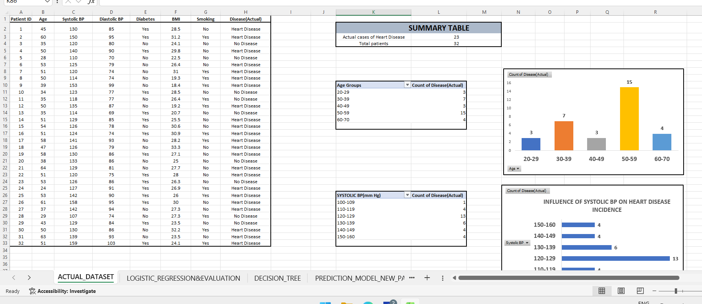

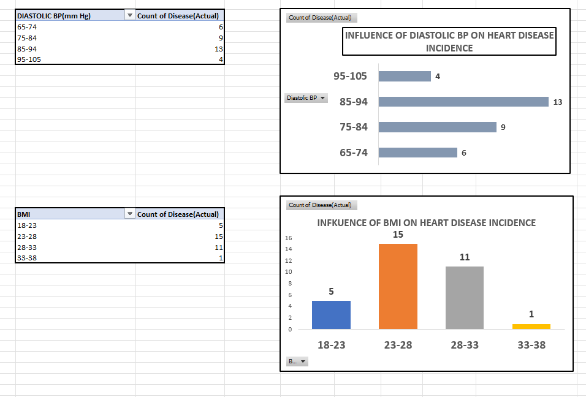

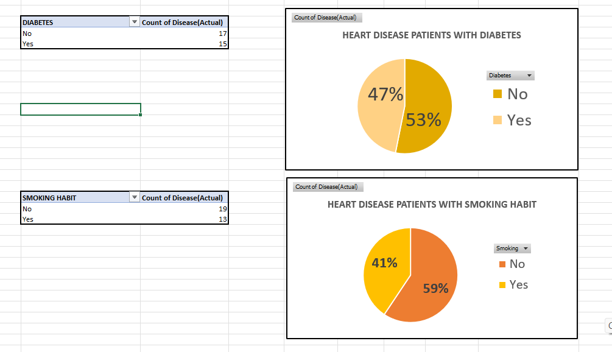

##  WORKSHEET 2 - LOGISTIC_REGRESSION&EVALUATION

1.Created a prediction table of the patient records. 

Created binary value columns using IF function for the following to facilitate z linear score calculation: 

✅Actual disease[Heart Disease-1,No Disease-0]

✅Diabetes[Yes-1,No-0]

✅Smoking[Yes-1,No-0].

2.Generated a summary output table including intercept,coefficients for each feature[age,BP,BMI,Systolic BP,Diastolic BP,smoking].

The table was generated using Regression feature of Excel Analysis ToolPak.

3.For all patients,the following were calculated:

✅LINEAR SCORE Z : Was calculated by taking the model's intercept plus the sum of each feature multiplied by its respective coefficient.Z score helps us know how far the data point is from the mean. 

SUMPRODUCT & TRANSPOSE FUNCTIONS were included in Z formula for each patient record.

✅PREDICTED PROBABILITY P: Was calculated using formula 1 / (1 + EXP(-Z))

4.  A THRESHOLD value was chosen to predict heart disease.If Predicted probability,P is greater than or equal to this value,the case was predicted as "Heart Disease".

Used IF function for Prediction.

   0.64 was chosen as THRESHOLD for Prediction.

This value helped reduce false positives, maximize overall accuracy and ensured that only patients with high P were interpreted to have heart disease.

5.A column including binary data variables was added to check whether predicted interpretation and actual interpretation were same. [IF function]

6.A binary column for Predictions were added where Heart Disease was given 1 & No Disease was given 0.[IF FUNCTION]

### OUTPUT OF LOGISTIC REGRESSION MODEL :PREDICTED 23 OUT OF 32 PATIENTS HAVE HEART DISEASE

7.A CONFUSION MATRIX was built with outcomes True Positive (TP), True Negative (TN), False Positive (FP), False Negative (FN). 

This matrix helps evaluate classification models by summarizing predictions against actual targets in a grid format.

Performance metrics such as Accuracy,Precision,Recall(Sensitivity),F1 score were derived using formulas incorporating the outcomes-TP,TN,FP,FN.

## Worksheet 2- LOGISTIC_REGRESSION& EVALUATION SCREEN CAPTURE

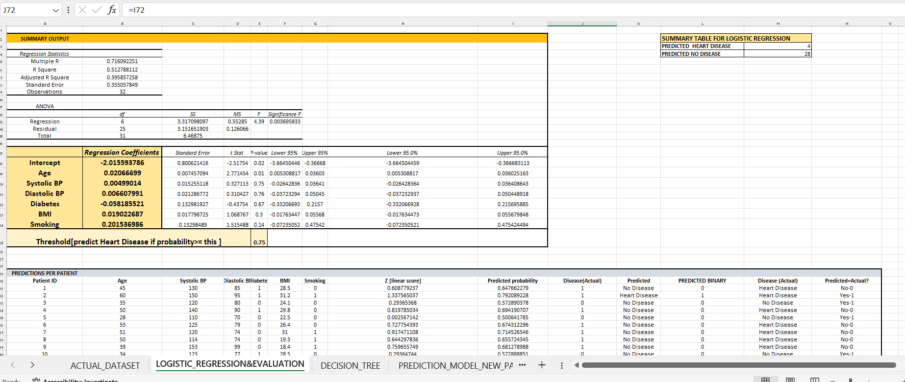

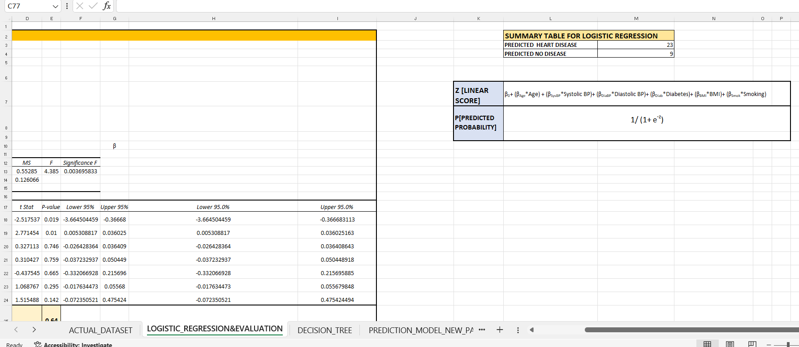

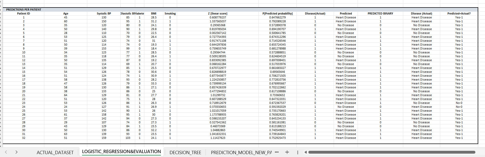

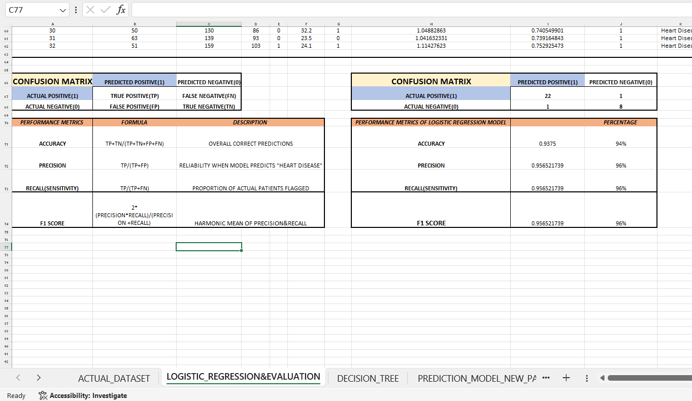

## Worksheet 3- DECISION_TREE

1.Created a prediction table including Prediction column.Compared the predicted interpretations with actual interpretation.

2.Prediction was done based on certain DECISION RULES [IFS FUNCTION used]. Created a SUMMARY TABLE of predictions using COUNTIF.

3.A CONFUSION MATRIX was built.

4.Performance metrics-Accuracy,precision,recall and F1 score were calculated using formulas.

### OUTPUT OF DECISION TREE MODEL: 22 OUT OF 32 PATIENTS WERE PREDICTED TO HAVE HEART DISEASE.

## WORKSHEET 3-DECISION_TREE SCREEN CAPTURE

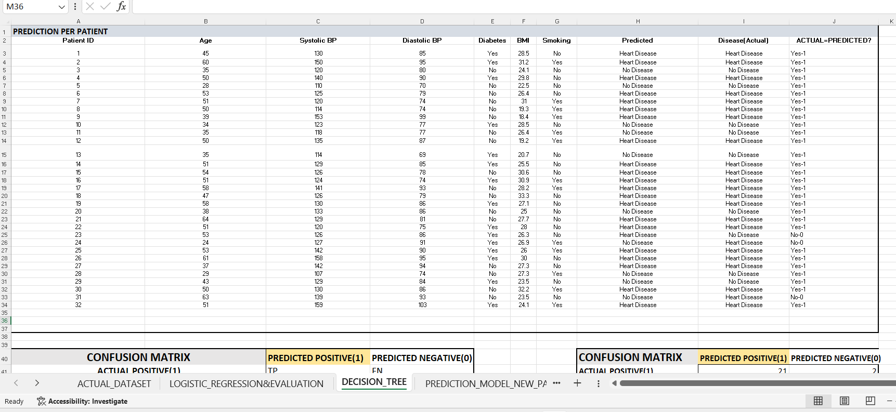

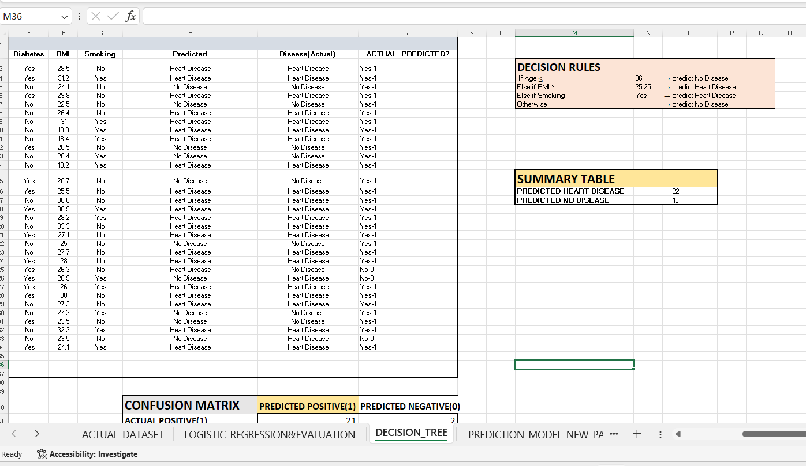

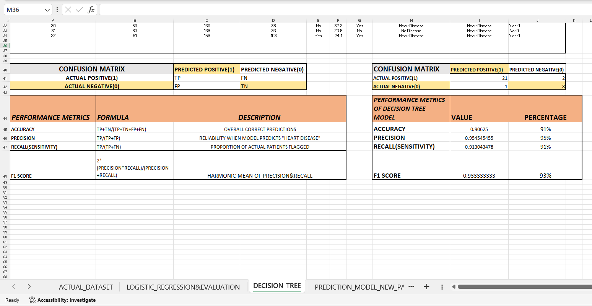

## Worksheet 4- PREDICTION_MODEL_NEW_PATIENT

1.Created a LOGISTIC REGRESSION & DECISION TREE MODEL for Heart disease prediction of new patient applying respective rules.

## WORKSHEET 4-PREDICTION_MODEL_NEW_PATIENT SCREEN CAPTURE

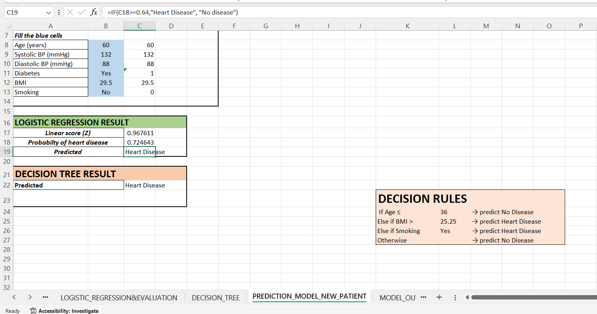

## Worksheet 5- MODEL_EVALUATION

Created charts from the following:

✅PREDICTION SUMMARY TABLES[BOTH LOGISTIC REGRESSION & DECISION TREE MODELS]

✅PERFORMANCE METRICS TABLES[BOTH LOGISTIC REGRESSION & DECISION TREE MODELS]

✅IMPACT OF PARAMETERS LIKE AGE,BP,BMI & SMOKING ON HEART DISEASE PREDICTION

## WORKSHEET 5- MODEL_EVALUATION SCREEN CAPTURE

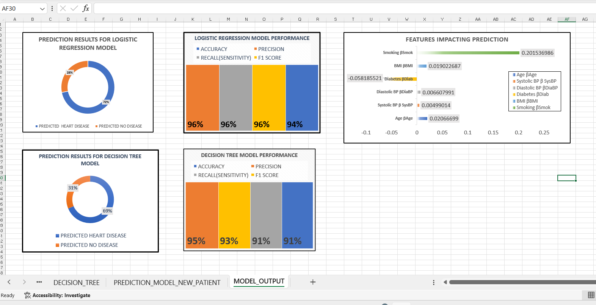

## KEY INSIGHTS

✅According to actual dataset,23 out of 32 patients had heart disease.

✅Patients of Age group-50 to 59 years, with Blood Pressure- 129-120/94-85 mm Hg and BMI 23-28 were more likely to have heart disease.

✅Diabetes and smoking were major contributing factors for Heart Disease.

✅LOGISTIC REGRESSION MODEL shows high performance metrics compared to DECISION TREE MODEL.

✅LOGISTIC REGRESSION MODEL is more reliable compared to DECISION TREE MODEL.

✅LOGISTIC REGRESSION predicted 23 heart disease patients whereas DECISION TREE MODEL predicted 22 heart disease patients.

---
---
# Adverse Drug Reaction Data Analysis[ID:task4]
Analyzed ADR datasets containing patient details, medication usage,ADR reported, SOC affected and onset timelines to determine seriousne.ss of ADRs. Identified high-risk medicines, commonly reported ADRs, most ADR reported countries and evaluated percentage of serious ADRs reported.

### View Full Project: [ADR_ANALYSIS.xlsx](./ADR_ANALYSIS.xlsx)

# Project Overview
## Worksheet 1 - ADR Analysis 
1.Created an ADR dataset with patient details, medication usage,ADR reported, SOC affected and onset timelines to determine seriousness of ADRs.SERIOUS Column was entered considering ONSET column values using IF Function- ADRs with onset of more than 2 days was labelled serious.

Highlighted the following using Conditional formatting:

✅ADRs with onset of not more than 2 days with green

✅Serious column entry YES with red 

2.Summarised the following using Excel functions:

✅total ADR reports [COUNTA FORMULA]

✅percentage of serious ADRs reported[basic percentage formula]

✅SOC-wise ADR distribution, Number of serious ADRs[COUNTIF FORMULA]

✅countries which reported ADRs[UNIQUE FORMULA]

3.Built Pivot tables on Country-wise percentage of reported ADRs , DRUG WISE SERIOUS/UNSERIOUS ADRs DISTRIBUTION.

### Worksheet 1- ADR ANALYSIS SCREEN CAPTURE

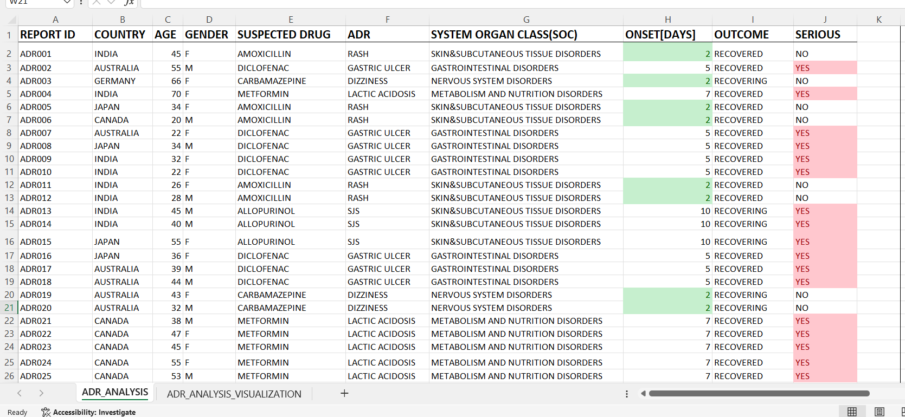

## Worksheet 2-ADR ANALYSIS VISUALIZATION

1.Built Pivot charts based on :

✅COUNTRY WISE PERCENTAGE OF REPORTED ADRs 

✅SOC WISE ADR REPORTING

✅DRUG WISE SERIOUS/UNSERIOUS ADRs[Drug Slicer included]

### Worksheet 2- ADR ANALYSIS VISUALIZATION SCREEN CAPTURE

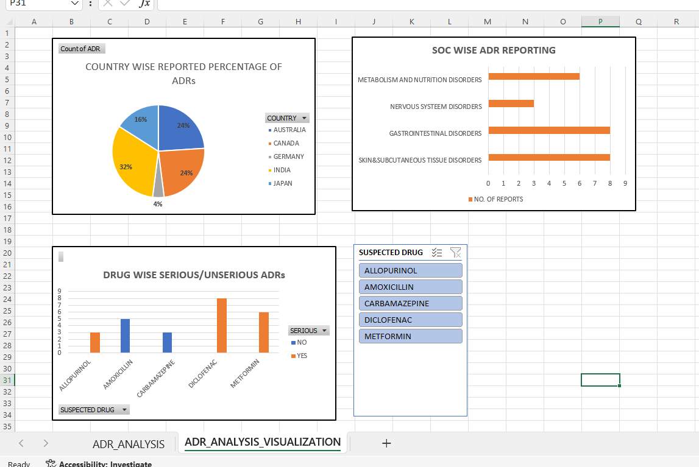

## KEY INSIGHTS

✅A total of 25 ADRs were reported

✅Most serious ADRs happened with Diclofenac 

✅High risk medicines include Diclofenac, Allopurinol and Metformin

✅India reported with most ADRs

✅Most ADRs were associated with Gastrointestinal and Skin disorders

✅68% of ADRs were reported serious

---
---
# Pharmacy Sales and Drug Analysis [ID: task3]
Analyzed pharmacy sales data to identify medicine usage trends and revenue patterns. Evaluated top-selling medicines, monthly sales growth, and compared branded versus generic medicines using sales datasets.

### View Full Project : [PHARMACY_SALES_ANALYSIS.xlsx](./PHARMACY_SALES_ANALYSIS.xlsx)

# Project Overview
## Worksheet 1 - Pharmacy sales data
1.Created a pharmacy sales dataset with date, drug details, quantity ordered, price and sales. Sales was calculated with formula PRODUCT(QUANTITY*PRICE)

2.Highlighted the following using Conditional formatting:

✅highest/least selling drugs(yellow data bars)

✅highest/least drug quantity orders(highest-red/least-green)

✅Drugs with top 5 sales (red bordered cells with bold text)

3.Calculated highest/least selling drug and highest/least drug quantity orders using formulas MIN, MAX.

4.Built a pivot table out of the dataset summarising monthly drug sales and comparison of generic/brand drug sales

### Worksheet 1- Pharmacy sales data SCREEN CAPTURE

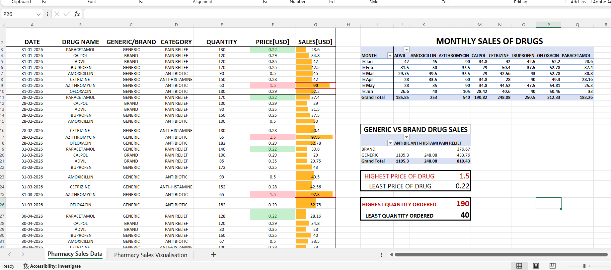

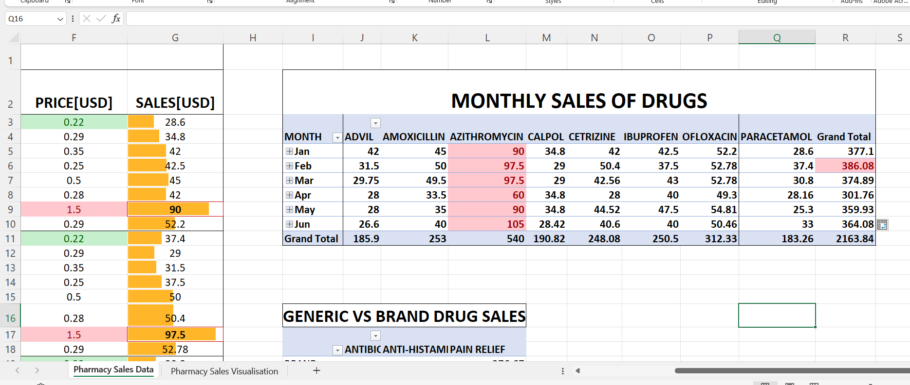

## Worksheet 2- Pharmacy sales visualization
1. Visualized "monthly drug sales" and "generic vs brand drug sales" using pivot chart. Added slicers to look for specific information, say to find the monthly sale for Amoxicillin, one can select Amoxicillin option from slicer. The pivot chart will display monthly sales for Amoxicillin alone.

### Worksheet 2- Pharmacy Sales visualization SCREEN CAPTURE

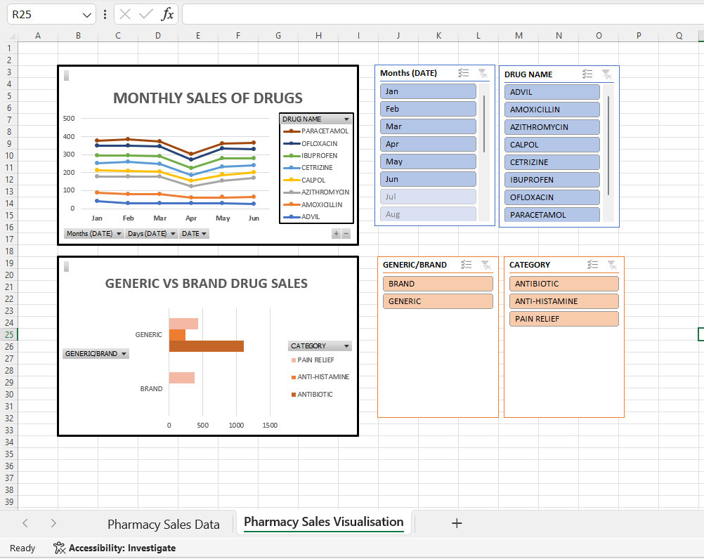

### Key Insights

✅Most selling drug : Azithromycin

✅Generic drugs are mostly ordered

✅Cheapest Drug : Paracetamol

✅Most Expensive drug: Azithromycin

✅Antibiotics are the top selling drugs.

✅Sales peaked in February 

---
---
# Healthcare Data Visualization [ID: task2]
Created visual representations of healthcare data using charts and graphs. Using the cleaned dataset, generated graphs and charts such as frequency of diseases, age group wise disease distribution, gender wise disease distribution, and dosage distribution to better understand healthcare trends and patterns.

### 📄View Full Project: [Dataset_Visualisation_PatientRecords.xlsx](./Dataset_Visualisation_PatientRecords.xlsx)

# Project Overview
## Worheet 2 - Clean and Analysed Patient Records
1. Created a visualization of the various disease trends among female/male patients using Column Sparklines in the pivot table representing Gender wise disease distribution

### Worksheet 2- Clean & Analysed Patient Records SCREEN CAPTURE

## Worksheet 3 - Data Visualization
1. Built Pivot charts from the pivot tables of 2nd worksheet.

2. Added slicers beside each pivot chart to clearly extract specific information.For example, in the slicer beside pivot chart representing Frequency of Diseases,one can select any of the diseases,say Diabetes and the pivot chart will display number of patients affected with diabetes.

### Worksheet 3 - Data Visualization SCREEN CAPTURE

---
---
# Healthcare Data Cleaning & Understanding  [ID: task1]
Worked with a healthcare dataset containing patient information such as age, gender, disease, medication, and dosage. Explored the dataset, identified and cleaned missing or duplicate records, and performed basic analysis such as patient count, common diseases, and different patient age groups. 

### 📄View Full Project: [Data_Cleaning_And_Basic_Analysis_PatientRecords.xlsx](./Data_Cleaning_And_Basic_Analysis_PatientRecords.xlsx)

# Project Overview
## Worsheet 1 - Unclean Patient Records
1.Created a sample patient records dataset with missing and duplicate entries

2.Identified and highlighted missing entries and duplicate patient IDs using Conditional Formatting.

3.Created a SUMMARY OF ERRORS  spotted from dataset which summarized the number of duplicate patient IDs and missing entries using SUMPRODUCT, COUNTIF and COUUNTBLANK FUNCTIONS.

### Worksheet 1- Unclean Patient Records SCREEN CAPTURE

## Worksheet 2 - Clean & Analysed Patient Records
1.Removed duplicate patient entries and filled in missing data.

2.Built Pivot tables from Cleaned dataset and extracted key insights, including :

 ✅Frequency of each disease

✅Gender wise Prevalence of each disease 

✅Highest Dosage Medications

✅Age groups consulted

 
### Worksheet 2- Clean & Analysed Patient Records SCREEN CAPTURE

