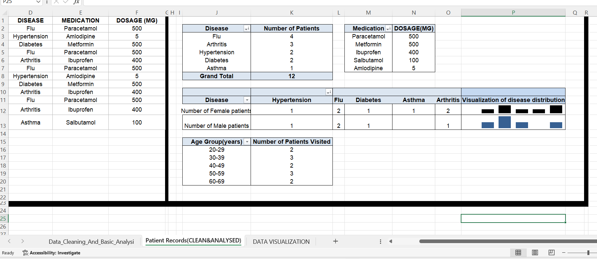
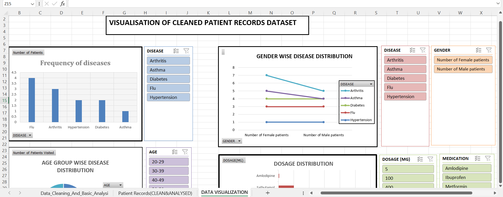
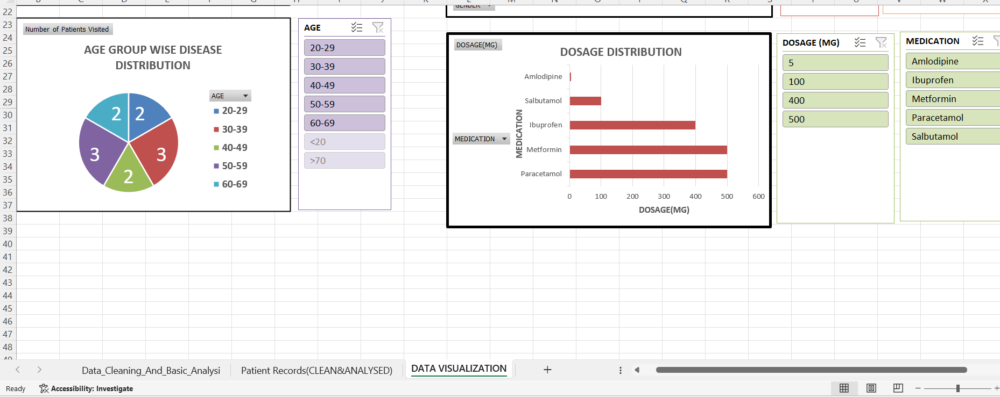
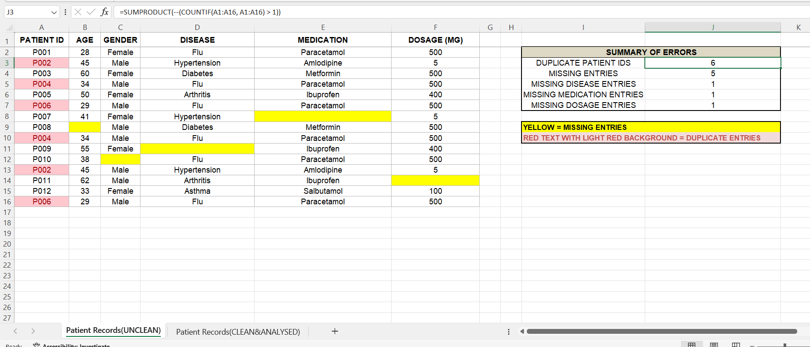
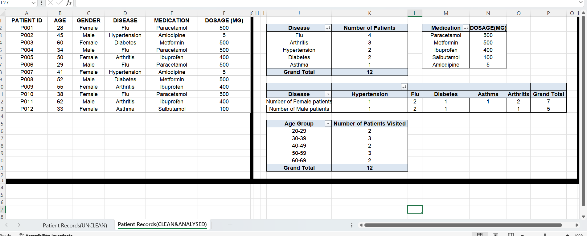

# VIRTUALWORKS LAB-HEALTHCARE-PHARMACY-DATA-ANALYTICS-INTERNSHIP-TASKS
This repository includes projects done by SNEHA P as part of VIRTUALWORKS LAB INTERNSHIP. Projects are focused on Applied data analytics in healthcare, clinical, and pharmaceutical domains

---

# Healthcare Data Visualization [ID: task2]
Created visual representations of healthcare data using charts and graphs. Using the cleaned dataset, generated graphs and charts such as frequency of diseases, age group wise disease distribution, gender wise disease distribution, and dosage distribution to better understand healthcare trends and patterns.

### 📄View Full Project: [Dataset_Visualisation_PatientRecords.xlsx](./Dataset_Visualisation_PatientRecords.xlsx)

# Project Overview
## Worheet 2 - Clean and Analysed Patient Records
1. Created a visualization of the various disease trends among female/male patients using Column Sparklines in the pivot table representing Gender wise disease distribution

### Worksheet 2- Clean & Analysed Patient Records SCREEN CAPTURE

## Worksheet 3 - Data Visualization
1. Built Pivot charts from the pivot tables of 2nd worksheet.

2. Added slicers beside each pivot chart to clearly extract specific information.For example, in the slicer beside pivot chart representing Frequency of Diseases,one can select any of the diseases,say Diabetes and the pivot chart will display number of patients affected with diabetes.

### Worksheet 3 - Data Visualization SCREEN CAPTURE

---
---
# Healthcare Data Cleaning & Understanding  [ID: task1]
Worked with a healthcare dataset containing patient information such as age, gender, disease, medication, and dosage. Explored the dataset, identified and cleaned missing or duplicate records, and performed basic analysis such as patient count, common diseases, and different patient age groups. 

### 📄View Full Project: [Data_Cleaning_And_Basic_Analysis_PatientRecords.xlsx](./Data_Cleaning_And_Basic_Analysis_PatientRecords.xlsx)

# Project Overview
## Worsheet 1 - Unclean Patient Records
1.Created a sample patient records dataset with missing and duplicate entries

2.Identified and highlighted missing entries and duplicate patient IDs using Conditional Formatting.

3.Created a SUMMARY OF ERRORS  spotted from dataset which summarized the number of duplicate patient IDs and missing entries using SUMPRODUCT, COUNTIF and COUUNTBLANK FUNCTIONS.

### Worksheet 1- Unclean Patient Records SCREEN CAPTURE

## Worksheet 2 - Clean & Analysed Patient Records
1.Removed duplicate patient entries and filled in missing data.

2.Built Pivot tables from Cleaned dataset and extracted key insights, including :

 ✅Frequency of each disease

✅Gender wise Prevalence of each disease 

✅Highest Dosage Medications

✅Age groups consulted

 
### Worksheet 2- Clean & Analysed Patient Records SCREEN CAPTURE

